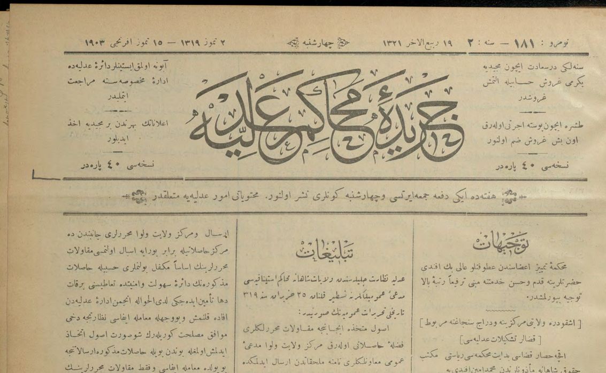
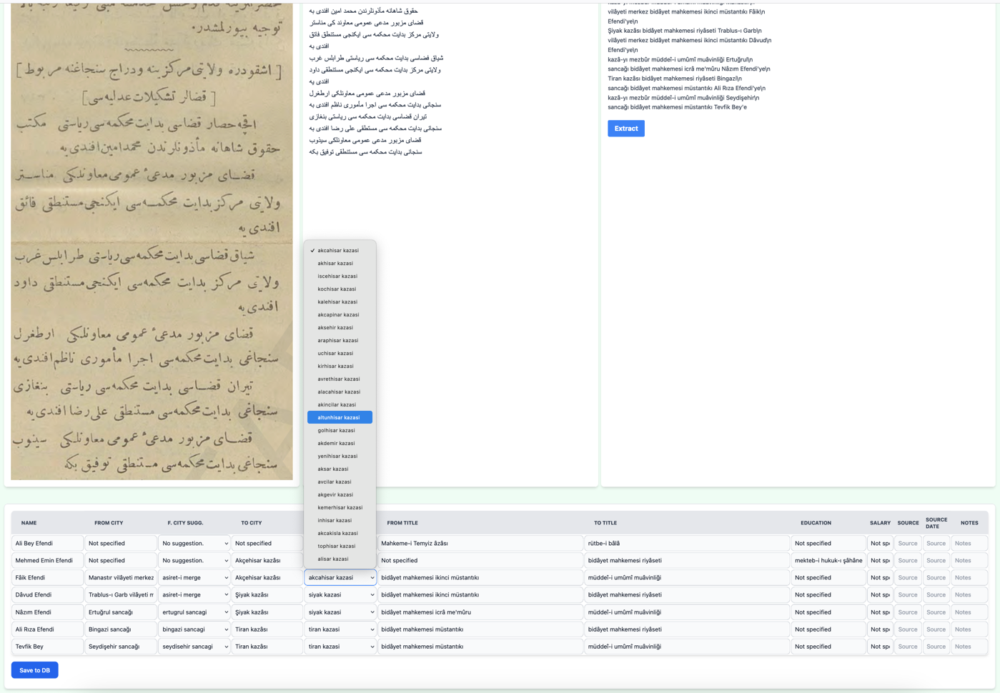

# Ottoman Mobility Analyzer
## Idea
Reading Ottoman text is cumbersome. And some historical sources
includes valuable information about the mobility of the Ottoman public officials.
This project aims to extract the mobility information from an 19th century Ottoman legal journal
called _Ceride-i Mehakim_.
The mobility information covers the following:
- The name of the official
- The position of the official
- The location of the official
- The new position of the official
- The new location of the official
- Sometimes education information of the official.

This is a valuable source for historians to understand the Ottoman bureaucracy and its
mobility patterns within its legal system.

## Current Status
This is a work-in-progress. At the moment users can copy-paste or select a png
file that includes the text of the _Ceride-i Mehakim_ and the program will
do OCR and then latinize the text. Finally, it will extract the mobility information
from the text. The extracted information will be saved in a sqlite DB.

## Features
- End-to-End Latinization of printed Ottoman texts.
- Extracting structured mobility information from the latinized text.
- Automatic location name suggestion/correction based on an excel list of location names.
- Storing the information in a sqlite DB.

## Pre-requisites
- Django 5.1.2
- Google Cloud account with Document AI API enabled
- Claude.AI API access

## Installation
-Setting up the .env file:
* An example.env file is provided. You can copy it to .env and fill the necessary fields.
* You will need have a Document AI processor in your Google Cloud account and enable it.
* You will fill `PROCESSOR_ID`, `PROJECT_ID`, and `LOCATION` using the values from Google Cloud.
* You also need to create a service account and download the key file (`GOOGLE_CLOUD_KEY_PATH`).
* You will also need to have an API Key (`CLAUDE_KEY`) from Claude.AI.

-Install the requirements:
`pip install -r ./requirements.txt`

-Run the migrations:
`python manage.py migrate`

-Installing Node dependencies:
`npm install`

-Running the server:
`python manage.py runserver`

## Testing & Testing Approach
As the project works with LLMs and their output is not deterministic, the project
does not stricly evaluate the LLM output. Instead, it uses general checks for
such outputs. For example, if the output is a valid JSON, if it has certain length etc.
Instead of using assertions, it simply logs the output if the output is not as expected.
Other than LLM outputs, the project uses tests for the model (test_models.py), views (test_views.py).
In addition, OCR output of the Google Document AI seems to be deterministic. Therefore, the project uses assertions to test it.

Test cases can be extended by adding more test cases to the test files (`/tests/test_data`).
`input` folder includes the image files to be tested, `expected` folder includes the expected output
(OCR and latinization seperately) of the tests.

To run the tests:
`pytest`
